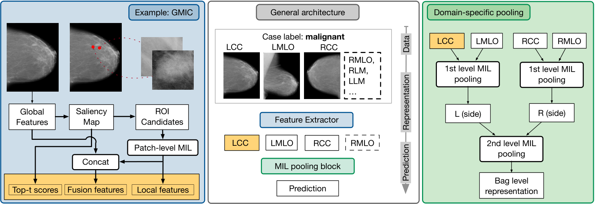

## Weakly Supervised Learning for Breast Cancer Prediction on Mammograms in Realistic Settings

This is a the code base of case-level breast cancer prediction using mammography. You can pass any number of images per case to our model, and the model will predict malignant or benign, along with a saliency map for each image and 6 candidate ROIs.

## Prerequisites
- Python 3.9.15
- Pytorch 1.11.0+cu113
- Cuda 11.3
- matplotlib 3.5.1
- opencv-python 4.6
- pandas 1.4.2
- openpyxl 3.0.9
- scikit-learn 1.0.2
- seaborn 0.11.2

## Datasets
We used 3 datasets in our work - CBIS (public dataset), VinDr (public dataset) and MGM (private dataset). We provide instructions on how to train and test our model on the 2 public datasets.   
- CBIS can be downloaded from [here](https://wiki.cancerimagingarchive.net/pages/viewpage.action?pageId=22516629).  
- VinDr can be downloaded from [here](https://vindr.ai/datasets/mammo).  

## How to create the preprocessed datasets?
1. Convert the dicom images to png with this [script](/src/data_processing/dicom_to_png.py).  
2. Convert the original png images to preprocessed png images (to remove irrelevant information and remove extra black background) according to our [image cleaning script](/src/data_processing/image_cleaning.py). 
3. Create the input csv file which contains the list of input instances and their corresponding groundtruth, for multi-instance and single-instance model training using the [script](/src/data_processing/input_csv_file_creation_cbis.py).

## How to train and evaluate the model?
1. Create the configuration file for storing input parameters for the code using this [config file creation script](/src/setup/config_file_creation.py). We have provided an example configuration file of our reproduction of single-instance model ($GMIC-ResNet18$) and our multi-instance learning models $ES-Att^{img}$ and $ES-Att^{side}$ for CBIS and VinDr. Please add your absolute input data path to the field "preprocessed_imagepath" and "SIL_csvfilepath" and "MIL_csvfilepath" in the script. 
2. Add this in your terminal or sbatch file (this is the path to wherever you have downloaded the src folder), otherwise the main script will not be able to find different modules: 
   > export PYTHONPATH=/home/src 
3. Run the code as follows: 
   > cd src  
   > python train_eval/train.py --config_file_path /home/modelid31_viewsinclusionall_femodelresnet34_learningtypeSIL/ --num_config_start 0 --num_config_end 1  
   
   Explanation of the above command:  
   --config_file_path, I have added the location of my config file. You can add yours. Trained models and results will get stored in this location.  
   --num_config_start and --num_config_end are the start and end id of the config files if there are >1 config file that I want to execute. I have only provided 1 config file, so this will be start and end will be 0 and 1. This argument is useful during hyperparameter tuning, where each config file contains a different hypeparameter combination  

## How to only evaluate the model?
1. We have provided our pretrained models [here](/pretrained-models) for users who want to only evaluate our model on CBIS/VinDr, or if someone wants to use our pretrained model for training on other datasets.
2. All the above steps in the above sections need to be followed, but before running 
  > python train_eval/train.py --config_file_path /home/modelid31_viewsinclusionall_femodelresnet34_learningtypeSIL/ --num_config_start 0 --num_config_end 1
  comment out lines 399 to 402 to only test the pretrained models.
 