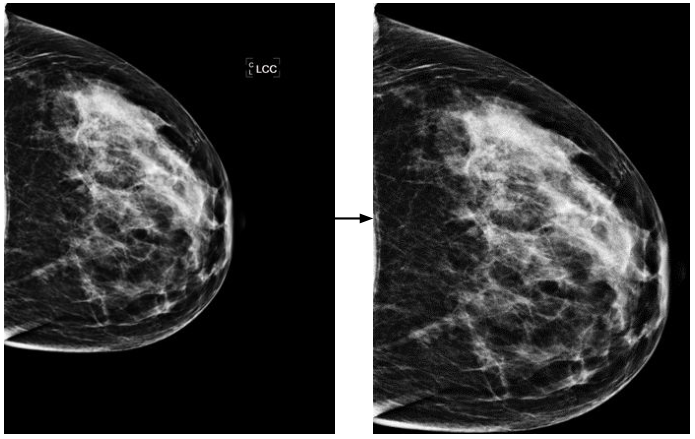
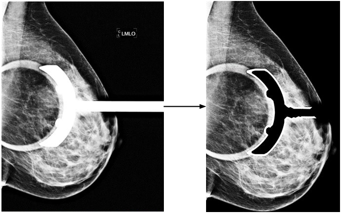
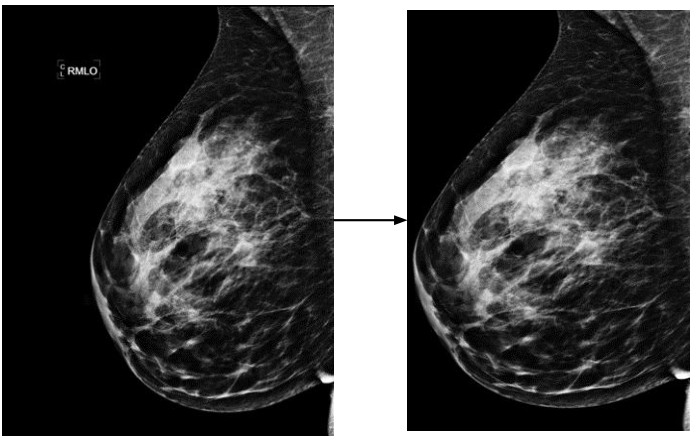

### Image Preprocessing

We first converted the dicom to png format. We generated the png images with the original bit depth that was used to capture the image (found in the dicom metadata). This resulted in MGM 12 bit images, CBIS and VinDr as 16 bit images. Then, we preprocessed the images to remove irrelevant information and excess background (the algorithm is described in the main paper and the code is shared in the repository). Figure below shows three examples of pre-processed images. It can be seen that the burned-in annotation with image types and the extra black background are removed in our pre-processed images. 

|  | 
|:--:| 
| *LCC* |
|  | 
| *LMLO* |
|  | 
| *RMLO* |

### References
1. E.-K. Kim, H.-E. Kim, K. Han, B. J. Kang, Y.-M. Sohn, O. H. Woo, and C. W. Lee, “Applying data-driven imaging biomarker in mammography for breast cancer screening: preliminary study,” Scientific reports, vol. 8, no. 1, pp. 1–8, 2018.  
2. X. Shu, L. Zhang, Z. Wang, Q. Lv, and Z. Yi, “Deep neural networks with region-based pooling structures for mammographic image classification,” IEEE transactions on medical imaging, vol. 39, no. 6, pp. 2246–2255, 2020.  
3. Y. Shen, N. Wu, J. Phang, J. Park, K. Liu, S. Tyagi, L. Heacock, S. G. Kim, L. Moy, K. Cho et al., “An interpretable classifier for high-resolution breast cancer screening images utilizing weakly supervised localization,” Medical image analysis, vol. 68, p. 101908, 2021.  
